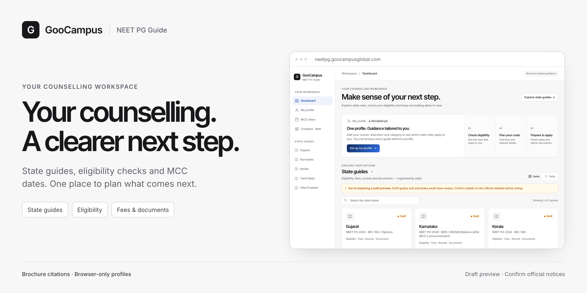
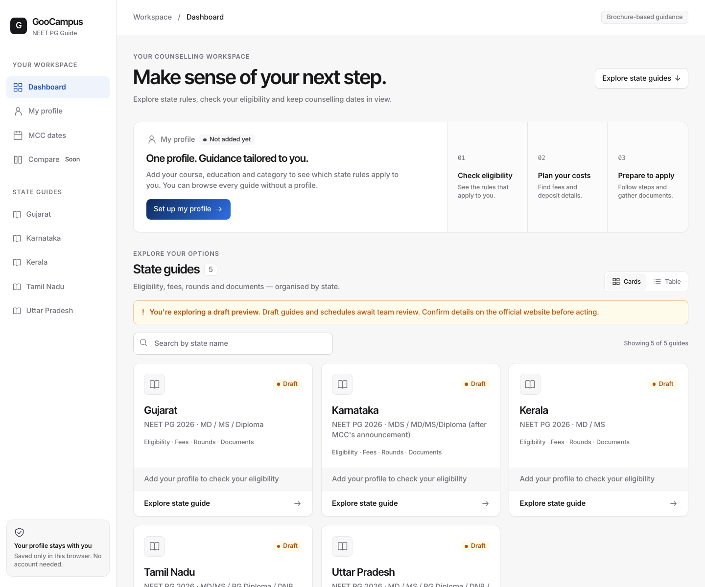
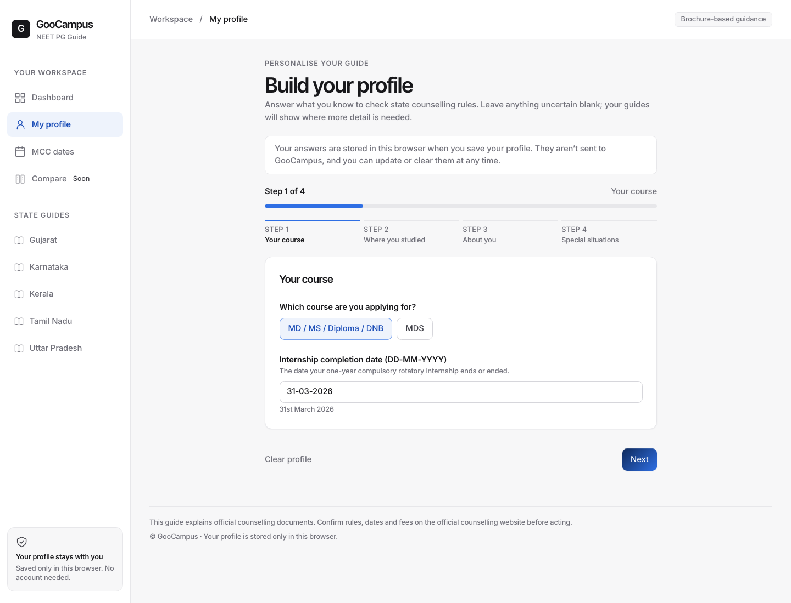
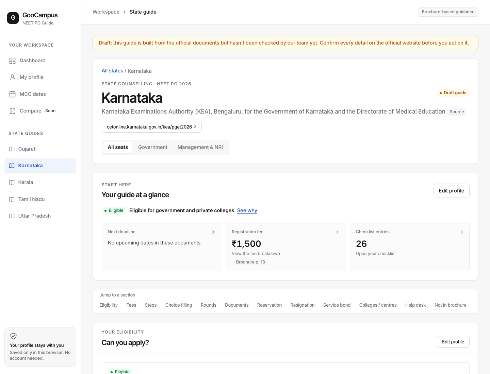
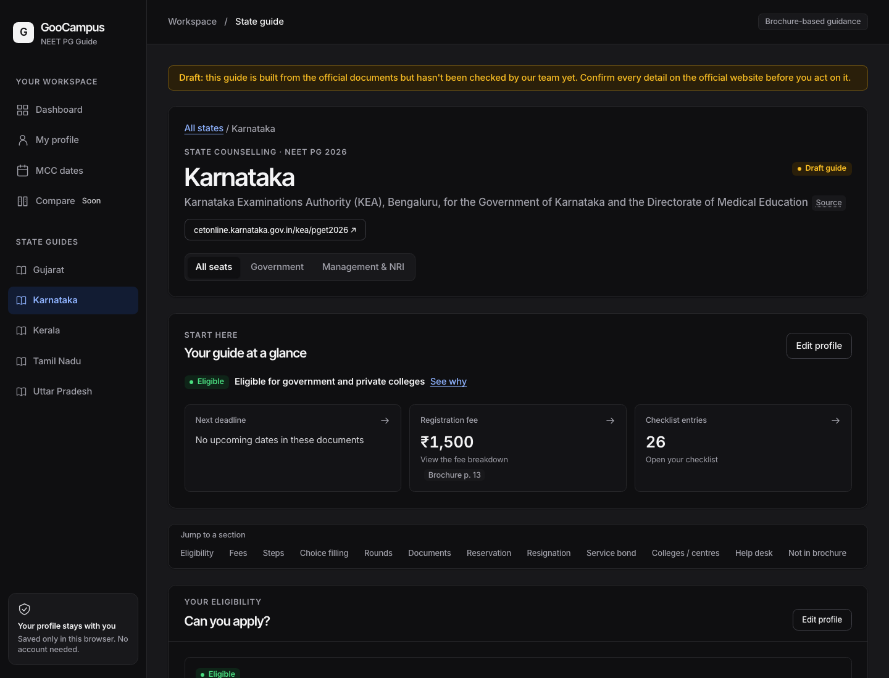
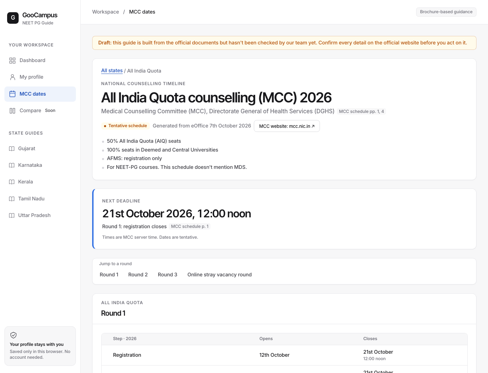
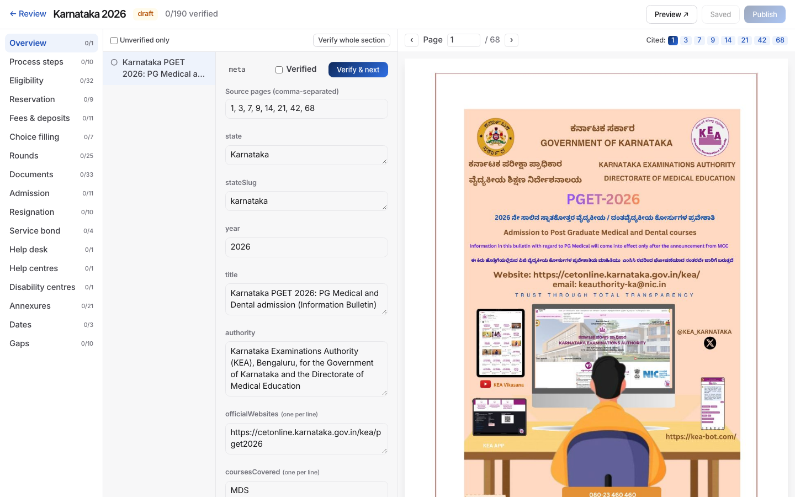

# NEET PG Brochure Guide



**Know what the counselling brochure says, and see how it applies to you.** This GooCampus guide turns
state and MCC counselling documents into clear, personalised steps, with every candidate-facing rule
cited to its source page.

| Go to | What you can do |
|---|---|
| [Dashboard](#dashboard) | Find state guides, filter by your eligibility summary, and see counselling tools. |
| [Profile](#profile) | Add your details once to personalise each guide. |
| [State guides](#state-guides) | Review eligibility, fees, deadlines, documents and round rules with brochure citations. |
| [MCC schedule](#mcc-schedule) | Follow the All India Quota timeline and its next deadline. |
| [Compare](#compare-states) | Coming soon: comparison unlocks when at least two state guides are published. |

**Local preview:** five state guides—Uttar Pradesh, Gujarat, Karnataka, Tamil Nadu and Kerala—plus
the MCC schedule are available as drafts. None has passed human verification, so the production build
does not publish them. **Public preview:** the last recorded deployment contains Uttar Pradesh,
Gujarat and Karnataka; check the [preview](https://neetpg.goocampusglobal.com) for its current contents.

Your profile stays in your browser. The app has no login, backend or database, and does not send candidate details anywhere.

## Dashboard

Search and filter the state guides, scan your eligibility summaries, and reach the profile, MCC dates
and comparison tools from one place.



## Profile

Answer a short set of questions once. The guide uses those details to explain which state rules apply and why; you can update them at any time.



## State guides

Each guide brings the main decision points together: eligibility and reasons, fees and deposits,
important dates, documents, seat types, round rules, reservation, resignation penalties, service bonds
and help centres. Expand the sections you need and follow each citation back to the source brochure page.

<p align="center">
  
  
</p>

## MCC schedule

See the All India Quota counselling stages, their opening and closing dates, and the next deadline.
The schedule is labelled tentative when the source document is tentative.



## Compare states

Comparison is designed to help candidates review state rules side by side. It becomes available after
at least two state guides are published. The guides in the local data are still drafts, so comparison
is currently locked.

<details>
<summary>How brochure review works</summary>

The authoring tool is available at `/review` on the local development server. It places each extracted
item beside its source page so a person can check the wording, verify it and publish it. Independent
extraction checks support that review; they do not replace human verification.



Every item stores its source page and review status. The validation gate prevents a state from being published until all sourced items are verified.

</details>

<details>
<summary>For maintainers: run, validate and extend the app</summary>

Requires Node 22 or later.

```bash
npm install
npm run dev          # student site: http://localhost:5173; review tool: /review
npm test             # Vitest eligibility and date logic tests
npm run validate     # schema and publish gate for state data
npm run typecheck
npm run check        # typecheck, tests and validation
npm run build        # production build: published data only
npm run build:preview # preview build: includes drafts and is noindexed
```

The data path is **official brochures → cited JSON → local review → static site**. The Zod schemas in
`src/schema/` define the data; `src/engine/` contains pure eligibility, deposit and document logic;
`src/app/` renders the candidate experience. Review code and its file API are development-only.

- [Handover guide](docs/HANDOVER.md): setup, architecture, maintenance and adding states.
- [Project status](docs/STATUS.md): current data, decisions and open questions.
- [Extraction procedure](.claude/skills/extract-brochure/SKILL.md): source handling and independent checks.
- [Design system](docs/design-system/README.md): Attio Mono tokens and components.
- [Visual assets](docs/images/README.md): screenshots and banner source notes.

</details>

## Sources and licence

Code and documentation are licensed under [MIT](LICENSE). The brochures in `brochures/` are official
publications of state counselling authorities and the Medical Counselling Committee; they are included
for reference and citation and are not covered by the MIT licence. This guide is not affiliated with a
counselling authority. Check the official source before acting on any counselling rule or date.
